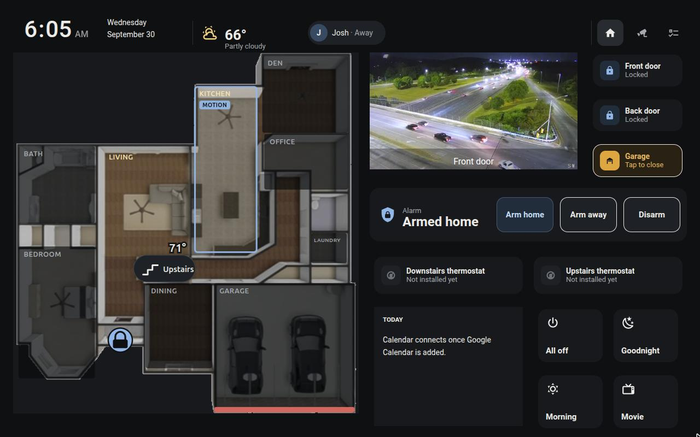
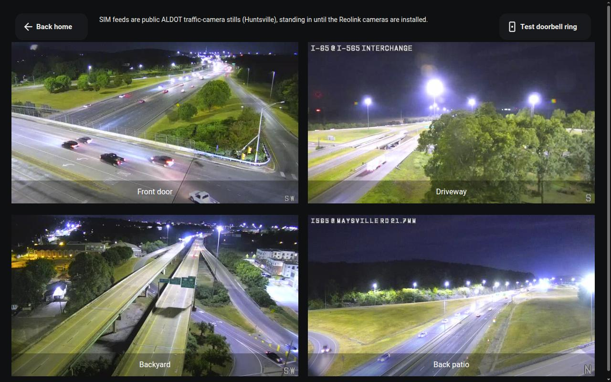

# HA Wall Panel

A floorplan wall-tablet dashboard for [Home Assistant](https://www.home-assistant.io/), and an
AI-agent skill that builds one for your house, starting from an empty box if you like.



*The main page at 1280×800 (Fire HD 10, landscape). The living room and kitchen lights are on,
the kitchen has motion, the garage door is open (red on the plan because the alarm is armed),
and the doorbell camera is live. Devices that aren't installed yet run as simulations.*

## What it is

One main page, sized to your tablet, covers almost everything you do day to day:

- **A live floorplan of your house**:
  - Rooms sit dim with the lights off and glow warm when they're on. Tap a room to toggle its lights.
  - Motion draws a blue outline and a MOTION tag that fades out.
  - Exterior doors get lock badges. The garage door edge turns amber when open, red if the alarm
    is armed.
  - Room temperatures, and a button on the stairs to switch floors.
- **A doorbell camera** on the main page that pops up full screen on the tablet when someone
  rings, then closes itself after two minutes.
- **Locks and garage** tiles. The garage asks before it moves.
- **Alarm** with large state text and plain buttons: Arm home, Arm away, Disarm.
- **Thermostats**, **today's calendar**, and **four scene buttons** you choose.
- **A header** with the clock, weather, who's home, and alert chips that only appear when
  something needs attention.
- Secondary pages for **other floors**, **all cameras** and **lists**.
- **Buttons on the plan itself**: locks at their doors, the garage, and cameras that open their
  live view. Locks and the garage need a **press and hold**; a tap just shows details. The wall
  panel's own tiles act on a tap, asking first before unlocking, moving the garage or disarming.
- **An optional phone dashboard** built from the same file: the floorplan with the same buttons,
  a Mode button and an alarm shield under it (hold to change), who's home and the thermostats,
  and a tab bar for cameras, calendar and lists.



**Devices you don't own yet still work.** Mark them `sim` and the kit creates stand-ins (lights,
motion, locks, garage, alarm, even cameras from public still images), so the panel is complete on
day one. Each real device you buy later replaces its stand-in with a one-line change.

## Get started with Claude Code

The kit is packaged as a skill, so an agent can run the whole build with you: interview,
floorplan, mockup, install, verification and tablet setup.

```bash
# 1. Install the skill (personal skills live in ~/.claude/skills/)
git clone <this repo> ~/.claude/skills/ha-wall-panel
pip install -r ~/.claude/skills/ha-wall-panel/requirements.txt

# 2. Make a folder for YOUR panel (it holds panel.yaml, floorplan images, connection details, build/)
mkdir ~/my-wall-panel && cd ~/my-wall-panel && git init

# 3. Start Claude Code there and ask
claude
> Build me a Home Assistant wall panel for my kitchen tablet.
```

Claude picks up the skill from your request, or you can invoke it directly with
`/ha-wall-panel`. It then works through these phases with you:

| Phase | What happens | You do |
|---|---|---|
| **0. From nothing** *(if needed)* | Picks a host, walks through installing Home Assistant OS, HACS and the Companion app, and suggests what to buy first | Buy and plug in hardware; create accounts |
| **1. Interview** | Asks about your tablet, floors and rooms, devices room by room (have it / simulate it / skip it), people, calendar and daily scenes | Answer, in plain words |
| **2. Floorplan** | Prepares your floorplan image. If you have none, sketches your house with you in conversation, walking it from the front door and redrawing until it's right | Say "the garage is further left" |
| **3. Mockup** | Shows the panel at your tablet's exact size before touching Home Assistant | Rename, move, cut |
| **4. Connect** | Asks you to install the SSH app and create a token. **You** hold the secrets; it never asks for them in chat | Two clicks and one paste into HA |
| **5. Build** | Backup, frontend cards, generate, deploy, restart once | Approve the changes |
| **6. Verify** | Checks the layout at your exact viewport with no scrolling, and exercises every state | Watch |
| **7. Tablet** | Fully Kiosk setup, viewport check, Browser Mod registration, doorbell test | Hold the tablet |
| **8. Hand-over** | How to swap in real devices, how to roll back, what's still pending | Keep the repo |

Other agents that read a `SKILL.md` (or a plain prompt: "follow SKILL.md in this repo") work
the same way.

## What you'll need

Everything below is covered in more depth, with sources and prices checked at the time of
writing, in [`references/from-scratch.md`](references/from-scratch.md).

### Minimum

| | |
|---|---|
| **Home Assistant OS** host | [Home Assistant Green](https://www.home-assistant.io/green/) ($199), a Raspberry Pi 5/4, an x86-64 mini PC, or a VM. **HA OS is required**: the kit uses Apps and the `ha` CLI, which Container installs don't have |
| **Wall tablet** | Amazon Fire HD 10 (2023): the layout's reference device (1280×800 CSS px). Other tablets work via the `viewport` setting |
| **Kiosk browser** | [Fully Kiosk Browser](https://www.fully-kiosk.com/) (free; PLUS €8.90 per device adds screen and motion control from HA) |
| **A computer** | Python 3.10+, `ssh`, git, to run the kit (or the agent) |
| **Accounts** | A GitHub account (for HACS) |

With only this, the panel runs fully, with every device simulated.

### Recommended devices, in the order most homes add them

1. **Doorbell**: [Reolink Video Doorbell](https://www.home-assistant.io/integrations/reolink/)
   (PoE preferred, Wi-Fi works). Local, and its ring drives the pop-up.
2. **Zigbee radio + door/window/motion sensors**:
   [Connect ZBT-2](https://www.home-assistant.io/connect/zbt-2/) ($49) with any ZHA-supported
   sensors. This makes the floorplan come alive.
3. **Alarm**: [Alarmo](https://github.com/nielsfaber/alarmo) (free, HACS) turns those sensors
   into an alarm panel.
4. **Locks**: Z-Wave or Matter deadbolts
   ([Connect ZWA-2](https://www.home-assistant.io/connect/zwa-2/), $69, for Z-Wave).
5. **Garage**: [ratgdo](https://github.com/ratgdo/esphome-ratgdo) (Chamberlain/LiftMaster) or
   [Tailwind iQ3](https://www.home-assistant.io/integrations/tailwind/).
6. **Lights and thermostats**: whatever you have. One light, or light group, per room is all the
   floorplan needs.

### Integrations and software used

| Required | Kind | Role |
|---|---|---|
| [Terminal & SSH](https://github.com/home-assistant/addons/tree/master/ssh) | App | How the kit reaches your config, backups and restarts |
| [HACS](https://hacs.xyz/) | App + integration | Installs the cards below |
| [ha-floorplan](https://github.com/ExperienceLovelace/ha-floorplan) | HACS card | The interactive floorplan |
| [button-card](https://github.com/custom-cards/button-card) | HACS card | Tiles, buttons and chips |
| [layout-card](https://github.com/thomasloven/lovelace-layout-card) | HACS card | The fixed grid |
| [kiosk-mode](https://github.com/NemesisRE/kiosk-mode) | HACS plugin | Hides HA's header and sidebar on the tablet |
| [Browser Mod](https://github.com/thomasloven/hass-browser_mod) | HACS integration | The full-screen doorbell pop-up |
| Template, helpers, script, automation, Met.no, Person / Mobile App, Camera / go2rtc | Built in | SIM devices, scenes, weather, presence, video |

| Optional, by what you own | Role |
|---|---|
| [Reolink](https://www.home-assistant.io/integrations/reolink/) / [UniFi Protect](https://www.home-assistant.io/integrations/unifiprotect/) | Doorbell and cameras |
| [ZHA](https://www.home-assistant.io/integrations/zha/) / [Z-Wave JS](https://www.home-assistant.io/integrations/zwave_js/) / [Matter](https://www.home-assistant.io/integrations/matter/) | Sensors, locks, lights |
| [Alarmo](https://github.com/nielsfaber/alarmo) or [Manual alarm](https://www.home-assistant.io/integrations/manual/) | Alarm panel |
| [ESPHome](https://esphome.io/) (ratgdo) / [Tailwind](https://www.home-assistant.io/integrations/tailwind/) | Garage door |
| [Google Calendar](https://www.home-assistant.io/integrations/google/) / [CalDAV](https://www.home-assistant.io/integrations/caldav/) / [Local Calendar](https://www.home-assistant.io/integrations/local_calendar/) | Today panel |
| [Fully Kiosk Browser](https://www.home-assistant.io/integrations/fully_kiosk/) | Wake the tablet screen when the doorbell rings |
| [Generic Camera](https://www.home-assistant.io/integrations/generic/) | Simulated cameras from public still images |

## How it works

```
interview ─▶ panel.yaml ─▶ generate.py ─▶ build/ ─▶ hactl.py deploy ─▶ Home Assistant
                 ▲                          ├─ dashboards/<name>.yaml   the panel
  floorplan ─────┘                          ├─ packages/<name>.yaml     SIM devices, scenes, doorbell pop-up
  (image or sketch)                         ├─ themes/<name>.yaml       dark theme
                                            └─ www/<name>/              floorplan SVG, CSS, images
```

Everything about your house lives in one file, **`panel.yaml`**
([reference](references/panel-schema.md), [example](examples/panel.example.yaml)): floors,
rooms and their rectangles on the plan, which entity controls what, people, scenes and cameras.
The generator turns it into Home Assistant files. You never hand-edit the dashboard. Change
`panel.yaml` and regenerate.

## Doing it by hand

```bash
# in your panel folder, with KIT=~/.claude/skills/ha-wall-panel (or wherever you cloned it)
cp $KIT/examples/panel.example.yaml panel.yaml          # then describe your house
python3 $KIT/scripts/prepare_floorplan.py ~/Downloads/plan.jpg --out floor-main.png
#   ...or, with no floorplan, sketch one from the room rectangles in panel.yaml:
python3 $KIT/scripts/sketch_floorplan.py panel.yaml --out floor-main.png --labels

cp $KIT/connection.example.yaml connection.yaml         # see "Connecting" below
python3 $KIT/scripts/hactl.py check
python3 $KIT/scripts/hactl.py backup "pre-wall-panel"
python3 $KIT/scripts/hactl.py hacs                      # the five frontend pieces
python3 $KIT/scripts/generate.py panel.yaml --out build
python3 $KIT/scripts/hactl.py deploy build
# add the configuration.yaml blocks below (once), `ha core check`, restart Home Assistant
python3 $KIT/scripts/hactl.py sim-cameras panel.yaml --dry-run   # then without --dry-run
```

Then open `http://<your-ha>:8123/wall-panel/home` on the tablet.

**configuration.yaml** (once). Merge into your existing keys; don't duplicate `homeassistant:`
or `frontend:`:

```yaml
homeassistant:
  packages: !include_dir_named packages

frontend:
  themes: !include_dir_merge_named themes

lovelace:
  dashboards:
    wall-panel:                       # the `dashboard` value from panel.yaml
      mode: yaml
      filename: dashboards/wall-panel.yaml
      title: Wall Panel
      icon: mdi:tablet-dashboard
      show_in_sidebar: true
```

## Connecting to Home Assistant

The scripts use SSH (files, backups, `ha` CLI), REST and websocket.

1. Make a key just for this: `ssh-keygen -t ed25519 -f ~/.ssh/ha_wall_panel_ed25519 -N ""`
2. In HA, go to **Settings → Apps → App store** and install the official **Terminal & SSH**
   (Apps were called add-ons before HA 2026.2). In its configuration:
   - Paste the `.pub` line under `authorized_keys`.
   - Set the **Network** port to `22`. It ships disabled.
   - Save, then start the app.
3. Create a **long-lived access token** (your profile → Security). Save it to a file (e.g.
   `~/.config/ha-wall-panel/token`, then `chmod 600` it), or export it as `HA_TOKEN`.
4. Fill in `connection.yaml` and run `hactl.py check`.

Revoke access any time by removing the key line from the app or deleting the token.
`connection.yaml` and `build/` are git-ignored.

## Day-two changes

| You want to... | Do this |
|---|---|
| Swap a SIM for a real device | In `panel.yaml`, replace `sim` with the entity id (e.g. `light: light.kitchen`), regenerate, deploy, `hactl.py reload` |
| Rename a room or move it on the plan | Edit `panel.yaml`, bump `asset_version`, regenerate and deploy, refresh the tablet |
| Add a floor | Add it under `floors:` with a `stairs` link from an existing floor. With no image it shows a placeholder |
| Change the look | Edit `templates/` (theme, floorplan CSS, button-card templates) and regenerate |
| New custom card installed | Restart Fully Kiosk on the tablet, or the new card shows red "!" icons |
| Undo everything | Remove the configuration.yaml blocks and restart, or restore the backup taken before the build |

## Design

Colour only means state (warm = lights, blue = secure, amber = open, red = problem). Normal
states stay out of the way, targets are finger-sized, motion is calm, and there's one main page
with no scrolling. The palette, layout grid and components are documented in
[`references/design-system.md`](references/design-system.md) and implemented in `templates/`.

## Known limits

- **Two-way talk** through the doorbell isn't possible in HA yet. The Reolink integration has
  no two-way audio, and browsers only allow the tablet's microphone over HTTPS.
- **Many public camera streams are DRM-protected**, so SIM cameras use still images.
- **Fire tablets and Fully Kiosk** are sensitive to HA frontend and Android WebView releases.
  Soak-test for 24 hours, and see [`references/sources.md`](references/sources.md) for known
  regressions.
- The layout is **landscape-first**. Portrait works but squeezes the floorplan.

## Repository layout

```
SKILL.md                     the agent procedure (phases 0–8)
scripts/
  generate.py                panel.yaml → dashboard, package, theme, floorplan assets
  prepare_floorplan.py       floorplan export → cropped, muted, transparent PNG
  sketch_floorplan.py        room rectangles → schematic floorplan PNG
  hactl.py                   check / backup / hacs / deploy / reload / sim-cameras / ssh / ws
templates/                   theme, floorplan CSS, button-card templates, viewport probe
references/                  from-scratch (parts and software), interview, floorplan, design system,
                             panel.yaml schema, HA access, tablet, sources of truth, troubleshooting
examples/                    a complete panel.yaml for a fictional house, with its sketched plan
docs/                        screenshots
```

## Status

Built and verified against Home Assistant 2026.9.4 on HA OS 18.3, with the card versions listed
in [`references/sources.md`](references/sources.md). The generator, the floorplan tools and
`hactl.py check`/`ssh`/`ws`/`sim-cameras` have been run against a live instance. `hactl.py`'s
`backup`, `hacs`, `deploy` and `reload` implement steps that were done by hand on the first
build and have not yet been exercised end-to-end through the script. The doorbell pop-up
automation is deployed but not yet confirmed on a physical tablet.

## License

[MIT](LICENSE)
